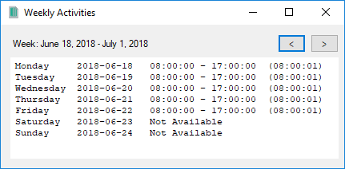

# Weekly Activities

Track your active presence on the computer.

The perfect tool for the lazy/smart programmers who want to track their presences in order to fill the timesheet at work.

You have the start time, the end time and the active duration. You can see the previous weeks as well. Everything is stored locally.

When there is no activity in the last 5 minutes, it consider you away.

The only thing you have to do is to let it run. You can minimize it and forget it.

    

# FAQ

I want to run it ?

- `git clone https://github.com/doxakis/WeeklyActivities.git`
- Open WeeklyActivities.sln with Visual Studio (2017+)
- Start the application (ctrl + F5)

I want it to start up automatically ?

- `git clone https://github.com/doxakis/WeeklyActivities.git`
- Open WeeklyActivities.sln with Visual Studio (2017+)
- Build the solution (ctrl + shift + b)
- Press: `Windows key + R`
- Open: `shell:startup`
- Right click / New / Shortcut
- Browse to the exe (for example, if you use the debug build: C:\path\to\the\repo\WeeklyActivities\bin\Debug\WeeklyActivities.exe)
- Press Finish
- Reboot or run it manually (double click on the Shortcut)

# Copyright and license
Code released under the MIT license.
